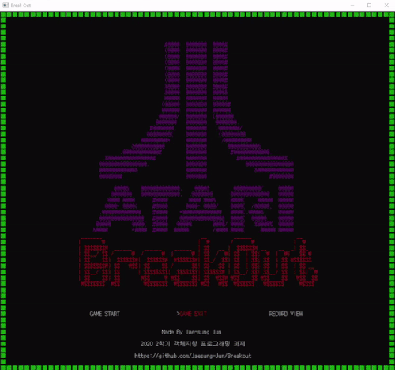
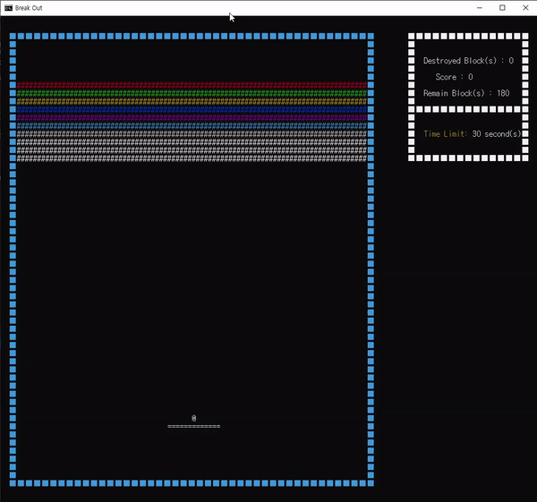

# Breakout - Windows Console Edition

# Description

Developed Atari's Breakout as C++ in Windows Console Environment.
And also, has scores and settings save & load features.

# Features

1. Save & Load Scores (File I/O)
2. Save & Load Settings (File I/O)
3. Language Support - Korean, English, Japanese
4. Console Double Buffering (Reference #1)

# Requirements

- Windows 10
- Microsoft visual c++ 2015 redistributable

# Play Screen

# Reference

1. [http://tikcode.tistory.com/4](http://tikcode.tistory.com/4) (Double Buffering)
